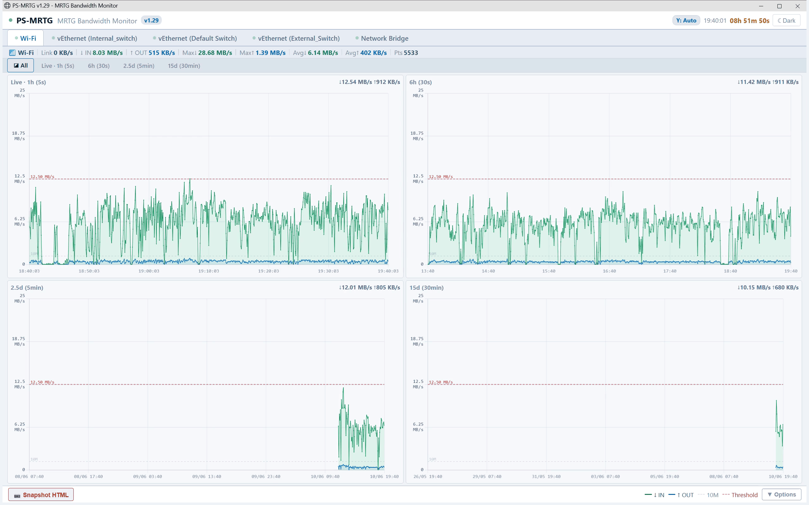

# PS-MRTG - MRTG Bandwidth Monitor

> Moniteur de bande passante réseau en temps réel, façon **MRTG**, écrit en **PowerShell**.
> Interface web interactive, 100 % offline, sans installation ni service.


[](https://www.powershellgallery.com/packages/PS-MRTG)
[](https://www.powershellgallery.com/packages/PS-MRTG)


PS-MRTG sonde les compteurs réseau de Windows et affiche, en direct dans votre
navigateur, les débits **entrant (IN)** et **sortant (OUT)** de chaque interface,
sur 4 échelles de temps (de la dernière heure aux 15 derniers jours).

---

## 📸 Aperçu

<p align="center">
  
</p>

---

## ✨ Fonctionnalités

- **Temps réel** : rafraîchissement automatique toutes les 2 secondes.
- **4 vues temporelles agrégées** par interface : Live (1 h), 6 h, 2,5 j, 15 j.
- **Vue « Tous »** : les 4 fenêtres côte à côte dans une grille 2×2, plus un mode plein écran par vue.
- **Débit IN / OUT** tracé en courbes lissées (Chart.js).
- **Échelle Y automatique** par paliers fins 1‑2‑5 (10 / 20 / 50 / 100 / 200 / 500 Mbps … jusqu'à 200 Gbps), ou **échelle fixe** au choix.
- **Seuil d'alarme** (ligne rouge) optionnel, qui ajuste l'échelle pour rester visible. Désactivé par défaut.
- **Axe temporel exact** : un historique partiel n'occupe que sa portion réelle du graphe (1 jour de données sur la vue 15 j = 1/15ᵉ de la largeur), avec graduations régulières (6 segments par graphe).
- **Thème clair / sombre**.
- **Export snapshot** de la vue Live.
- **100 % offline** : aucune dépendance réseau une fois Chart.js déposé localement.
- **Compatible ConstrainedLanguage** (environnements verrouillés) — PowerShell 5.1 et 7+.

---

## 🧩 Les 4 vues temporelles

Chaque vue conserve 720 points ; le « recul » est la fenêtre couverte une fois le tampon plein.

| Vue   | Résolution (1 point =) | Calcul du recul                       | Recul    |
|-------|------------------------|---------------------------------------|----------|
| Live  | 5 s (brut)             | 720 × 5 s = 3 600 s                    | **1 h**  |
| Hour  | 30 s (moy. 6 pts)      | 720 × 30 s = 21 600 s = 360 min       | **6 h**  |
| Day   | 5 min (moy. 60 pts)    | 720 × 5 min = 3 600 min = 60 h        | **2,5 j**|
| Week  | 30 min (moy. 360 pts)  | 720 × 30 min = 21 600 min = 360 h     | **15 j** |

---

## ✅ Prérequis

- **Windows** 10 / 11 ou Windows Server.
- **PowerShell 5.1** (intégré à Windows) ou **PowerShell 7+**.
- Un navigateur récent : **Microsoft Edge** ou **Google Chrome** recommandés.
- **Chart.js 4.4.0** (`chart.umd.min.js`) - voir l'installation ci‑dessous.

> Les compteurs sont lus via `Get-NetAdapterStatistics` (avec repli sur d'autres méthodes). Aucun droit administrateur n'est requis dans la plupart des cas.

---

## 📥 Installation

### Option A — PowerShell Gallery (recommandé)

PS-MRTG est publié sur la [PowerShell Gallery](https://www.powershellgallery.com/packages/PS-MRTG) :

```powershell
# Installation (pour l'utilisateur courant, sans droits admin)
Install-Script -Name PS-MRTG -Scope CurrentUser

# Mise à jour vers la dernière version
Update-Script -Name PS-MRTG

# Réinstallation propre (force la dernière version)
Uninstall-Script -Name PS-MRTG -Force
Install-Script   -Name PS-MRTG -Force

# Désinstallation
Uninstall-Script -Name PS-MRTG -Force
```

> **Première installation ?** PowerShell peut demander d'installer le fournisseur **NuGet**
> et de faire confiance au dépôt **PSGallery** : répondez `Y` (Oui), ou exécutez au préalable :
> ```powershell
> Set-PSRepository -Name PSGallery -InstallationPolicy Trusted
> ```

Le script est installé dans le dossier `Scripts` de PowerShell
(`$env:USERPROFILE\Documents\WindowsPowerShell\Scripts` avec `-Scope CurrentUser`,
`C:\Program Files\WindowsPowerShell\Scripts` sinon). Ce dossier étant ajouté au `PATH`,
vous pouvez ensuite lancer le moniteur depuis n'importe où :

```powershell
PS-MRTG.ps1
```

Vérifier la version installée :

```powershell
Get-InstalledScript -Name PS-MRTG
```

> **PowerShell 7+ / PSResourceGet** — l'équivalent moderne fonctionne aussi :
> ```powershell
> Install-PSResource -Name PS-MRTG
> Update-PSResource  -Name PS-MRTG
> Uninstall-PSResource -Name PS-MRTG
> ```

### Option B — Clonage du dépôt (manuel)

1. **Cloner le dépôt** (ou télécharger le `.ps1`) :

   ```powershell
   git clone https://github.com/Vietnamix/PS-MRTG.git
   cd PS-MRTG
   ```

### Chart.js en local (commun aux deux options)

**Fournissez Chart.js en local** (recommandé pour le mode offline).
Téléchargez `chart.umd.min.js` depuis le CDN officiel :

```
https://cdn.jsdelivr.net/npm/chart.js@4.4.0/dist/chart.umd.min.js
```

Renommez‑le `chartjs.min.js` et placez‑le dans l'un de ces emplacements (le script les cherche dans cet ordre) :

```
%TEMP%\PSMrtg\chartjs.min.js
%USERPROFILE%\Documents\chartjs.min.js
%USERPROFILE%\Desktop\chartjs.min.js
```

> Si le fichier est introuvable, le script tente de le télécharger automatiquement, puis se rabat en dernier recours sur le CDN (ce qui nécessite alors une connexion Internet).

---

## ▶️ Utilisation

Si installé depuis la PowerShell Gallery :

```powershell
PS-MRTG.ps1
```

Si cloné depuis GitHub :

```powershell
.\PS-MRTG.ps1
```

Le script :
1. détecte les interfaces réseau actives ;
2. génère le tableau de bord HTML et le fichier de données dans `%TEMP%\PSMrtg\` ;
3. ouvre automatiquement le navigateur sur le tableau de bord ;
4. met à jour les données toutes les 2 secondes.

**Arrêt** : `Ctrl + C` dans la console PowerShell.

> **Politique d'exécution** — si le script est bloqué, autorisez‑le pour la session courante :
> ```powershell
> powershell -ExecutionPolicy Bypass -File .\PS-MRTG.ps1
> ```
> Lancé depuis l'ISE, le script se relance tout seul dans `powershell.exe`.

---

## ⚙️ Configuration

Les paramètres se règlent en tête du script :

| Variable               | Défaut   | Rôle                                                        |
|------------------------|----------|-------------------------------------------------------------|
| `$IntervalSec`         | `5`      | Intervalle de collecte des compteurs (secondes).           |
| `$WriteEvery`          | `2`      | Fréquence d'écriture des données pour le navigateur (s).    |
| `$MaxPoints`           | `720`    | Nombre de points conservés par vue.                         |
| `$YScaleMode`          | `"auto"` | `"auto"` (paliers) ou une valeur fixe en Mbps (ex. `1000`). |
| `$ThresholdAlertMbps`  | `150`    | Valeur pré‑remplie du seuil d'alarme (Mbps).                |
| `$ThresholdEnabled`    | `$false` | Seuil actif au démarrage (`$true` = ligne rouge visible).   |

Les réglages **Thème**, **Échelle Y**, **Seuil** et **Taille des points** sont aussi modifiables en direct depuis l'interface.

---

## 🏗️ Fonctionnement

```
┌────────────────────┐     écrit toutes les 2 s     ┌──────────────────────┐
│  PowerShell         │ ───────────────────────────► │  network_data.js      │
│  (collecte /5 s)    │                              │  (dans %TEMP%\PSMrtg) │
└────────────────────┘                              └───────────┬──────────┘
                                                                │ recharge /2 s
                                                                ▼
                                                    ┌──────────────────────┐
                                                    │  dashboard.html        │
                                                    │  + Chart.js (offline) │
                                                    └──────────────────────┘
```

- PowerShell lit les compteurs réseau toutes les **5 s**, calcule les débits, agrège les 4 vues.
- Il écrit `network_data.js` toutes les **2 s**.
- Le navigateur recharge ce fichier toutes les **2 s** et redessine les graphiques.

### Fichiers générés (dans `%TEMP%\PSMrtg\`)

| Fichier             | Contenu                                  |
|---------------------|------------------------------------------|
| `dashboard.html`    | Le tableau de bord (HTML + JS + Chart.js).|
| `network_data.js`   | Les données de débit, réécrites en continu.|
| `mrtg_cmd.js`       | Canal de commandes léger UI → script.    |
| `chartjs.min.js`    | Copie locale de Chart.js (si déposée).   |

---

## 🖥️ Le tableau de bord

- **Sélecteur d'interface** : choisissez la carte réseau à observer.
- **Onglets de vue** : `Live · 1h (5s)`, `6h (30s)`, `2.5j (5min)`, `15j (30min)`, plus la vue **Tous**.
- **Échelle Y** : Auto (paliers) ou valeur fixe (10 Mbps → 200 Gbps).
- **Seuil** : cochez la case et saisissez une valeur en Mbps pour afficher la ligne d'alarme.
- **Thème** : bascule clair / sombre.
- **Snapshot** : exporte la vue Live.

---

## 🩺 Dépannage

- **Aucune interface détectée** : vérifiez que `Get-NetAdapterStatistics` fonctionne (`Get-NetAdapterStatistics` en console). Certaines interfaces virtuelles n'exposent pas de compteurs.
- **Graphiques vides / « Chart is not defined »** : `chartjs.min.js` n'a pas été trouvé localement et aucune connexion n'est disponible. Déposez le fichier dans `%TEMP%\PSMrtg\`.
- **Le navigateur ne s'ouvre pas** : ouvrez manuellement `%TEMP%\PSMrtg\dashboard.html`.
- **Script bloqué au lancement** : utilisez `-ExecutionPolicy Bypass` (voir plus haut).
- **`PS-MRTG.ps1` introuvable après `Install-Script`** : ouvrez une nouvelle console (le `PATH` est mis à jour à l'ouverture de session), ou lancez `& "$env:USERPROFILE\Documents\WindowsPowerShell\Scripts\PS-MRTG.ps1"`.

---

## 🤝 Contribuer

Les contributions sont les bienvenues !

1. Forkez le dépôt.
2. Créez une branche : `git checkout -b feature/ma-fonctionnalite`.
3. Committez : `git commit -m "Ajout de ma fonctionnalité"`.
4. Poussez : `git push origin feature/ma-fonctionnalite`.
5. Ouvrez une Pull Request.

Merci de décrire clairement le comportement attendu et l'environnement testé (version de PowerShell, Windows, navigateur).

---

## 📝 Changelog

- **v1.29** — Lisibilité v2 : tailles de police des graphiques centralisées dans une constante `FS` (corrige la régression v1.27 où la mise à jour /2 s annulait silencieusement l'agrandissement des polices d'axes), graduations d'axe agrandies (12px compact / 15px plein écran), tooltips 14px, UI globale agrandie d'un cran (en‑tête, onglets, barre de stats, légende, Options).
- **v1.28** — Cadence d'écriture corrigée : `network_data.js` n'est réécrit que si de **nouvelles** données ont été collectées — cadence effective = max(`$WriteEvery`, `$IntervalSec`), soit une écriture par collecte.
- **v1.27** — Lisibilité v1 : premier agrandissement des polices d'axes des graphiques.
- **v1.26** — **FIX crash de parsing** : fichier désormais **100 % ASCII** (tirets cadratins, caractères semi‑graphiques et points médians remplacés). Sans BOM UTF‑8, PowerShell 5.1 lisait le fichier en ANSI et un tiret cadratin devenait un guillemet qui terminait une chaîne → explosion du parseur. L'encodage ne peut plus rien casser : le script se parse à l'identique avec ou sans BOM.
- **v1.25** — **FIX popup de traduction** (la page déclarait `lang="fr"` : désormais `lang="en"` + `translate="no"` + meta `notranslate` + `--lang=en-US`) ; **ouverture de fenêtre bien plus rapide** : profil navigateur stable réutilisé entre les lancements (au lieu d'une initialisation complète à chaque fois).
- **v1.24** — Architecture d'arrêt **découplée** : (A) relance → passation instantanée via `instance.lock` (l'ancienne instance détecte un nouveau PID et s'efface d'elle‑même, aucun chevauchement) ; (B) fermeture de fenêtre → détection à triple signal (titre + profil + handle) maintenue ~60 s avant arrêt → faux arrêt quasi impossible. Reprise au démarrage « graceful‑first » (arrêt forcé en dernier recours).
- **v1.23** — **FIX faux auto‑arrêt** : la détection de fenêtre combine désormais trois signaux (titre de fenêtre, dossier de profil dédié, handle du processus) et exige une absence soutenue (~30 s) avant de conclure « fermée ».
- **v1.22** — **FIX auto‑arrêt** : la fenêtre est détectée via tout processus navigateur utilisant notre profil `--user-data-dir` dédié (Edge/Chrome relaient le processus lancé à une instance existante, ce qui rendait la surveillance par PID inopérante) ; **instance unique** via fichier verrou (deux exécutions ne doublonnent plus les graphes) ; sortie propre (verrou libéré, fenêtre fermée).
- **v1.21** — Métadonnées PowerShell Gallery : icône (`ICONURI`), tags étendus (badges `PSEdition_Desktop`/`Core`), description enrichie pour la découvrabilité. Aucun changement fonctionnel.
- **v1.20** — **FIX régression v1.18** : en mode caché, la surveillance du navigateur pouvait arrêter le script en ~5 s (processus lanceur Edge/Chrome quittant aussitôt) → graphe vide. Auto‑arrêt durci (délai de grâce 30 s, double confirmation) ; **journal de diagnostic** `%TEMP%\PSMrtg\PS-MRTG.log` via `Start-Transcript`.
- **v1.19** — **Traduction intégrale en anglais** : commentaires, messages console et UI HTML. Effet de bord : plus aucun caractère accentué → fin des risques d'encodage/mojibake. Message d'attente explicite lors de la relance depuis l'ISE.
- **v1.18** — **Console PowerShell cachée** (`HideConsole`) : seule la fenêtre du navigateur reste visible (mode `--app`) ; **auto‑arrêt** à la fermeture de la fenêtre HTML.
- **v1.17** — **FIX détection ISE** via `$PSCommandPath` : le script fonctionne aussi lancé directement ou installé depuis la PowerShell Gallery.
- **v1.16** — Axe X divisé en 6 segments égaux (10 min en Live, 1 h / 10 h / 60 h selon la vue).
- **v1.15** — Axe X à domaine temporel fixe : les données s'affichent à leur position réelle.
- **v1.14** — Affichage du recul (période couverte) à côté de chaque graphique.
- **v1.13 / v1.12** — Dates sur l'axe des temps (lisibilité des vues multi‑jours).
- **v1.11** — Heures à la même taille que les débits.
- **v1.10** — Paliers d'échelle plus fins (200 / 500 Mbps…), seuil désactivé par défaut.
- **v1.9** — Échelle commune aux 4 vues, lisibilité de l'axe Y, seuil intégré à l'échelle.

---

## 📄 Licence

Distribué sous licence **MIT**. Voir le fichier [`LICENSE.md`](LICENSE.md).

---

## 👤 Auteur

**[Eric Guiffault](https://eric.guiffault.com)**

Si ce projet vous est utile, pensez à me laisser une ⭐ sur GitHub !
